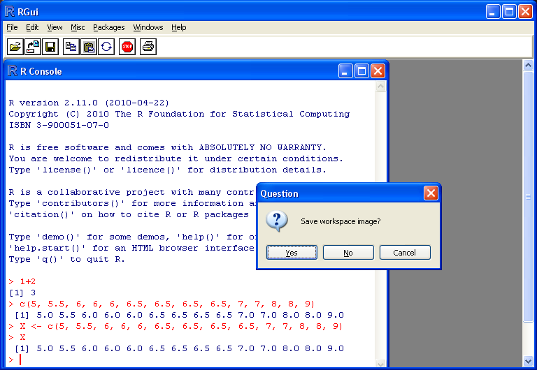

\mainmatter

# Introduction {#ChapIntroR}

## Student Learning Objectives

This chapter introduces the basic concepts of statistics. Special
attention is given to concepts that are used in the first part of this
book, the part that deals with graphical and numeric statistical ways to
describe data (descriptive statistics) as well as mathematical theory of
probability that enables statisticians to draw conclusions from data.

The course applies the widely used freeware programming environment for
statistical analysis, known as `R`. In this chapter we will discuss the
installation of the program and present very basic features of that
system.

By the end of this chapter, the student should be able to:

- Recognize key terms in statistics and probability.
- Install the `R` program on an accessible computer.
- Learn and apply a few basic operations of the computational system `R`.

## Why Learn Statistics?

You are probably asking yourself the question, “When and where will I
use statistics?". If you read any newspaper or watch television, or use
the Internet, you will see statistical information. There are statistics
about crime, sports, education, politics, and real estate. Typically,
when you read a newspaper article or watch a news program on television,
you are given sample information. With this information, you may make a
decision about the correctness of a statement, claim, or “fact".
Statistical methods can help you make the “best educated guess".

Since you will undoubtedly be given statistical information at some
point in your life, you need to know some techniques to analyze the
information thoughtfully. Think about buying a house or managing a
budget. Think about your chosen profession. The fields of economics,
business, psychology, education, biology, law, computer science, police
science, and early childhood development require at least one course in
statistics.

Included in this chapter are the basic ideas and words of probability
and statistics. In the process of learning the first part of the book,
and more so in the second part of the book, you will understand that
statistics and probability work together.

## Statistics

The science of statistics deals with the collection, analysis,
interpretation, and presentation of data. We see and use data in our
everyday lives. To be able to use data correctly is essential to many
professions and is in your own best self-interest.

```{r intror1, fig.cap='Frequency of Average Time (in Hours) Spent Sleeping per Night', echo=FALSE, message=FALSE,warning=FALSE, out.width = '60%', fig.align = "center"}
plot(table(c(5,5.5,6,6,6,6.5,6.5,6.5,6.5,7,7,8,8,9)), xlab="x = Time",ylab="y = Frequency")
```

For example, assume the average time (in hours, to the nearest
half-hour) a group of people sleep per night has been recorded. Consider
the following data:

$$5,\; 5.5,\; 6,\; 6,\; 6,\; 6.5,\; 6.5,\; 6.5,\; 6.5,\; 7,\; 7,\; 8,\; 8,\; 9\;.$$

In Figure \@ref(fig:intror1) this data is presented in a graphical form
(called a bar plot). A bar plot consists of a number axis (the $x$-axis)
and bars (vertical lines) positioned above the number axis. The length
of each bar corresponds to the number of data points that obtain the
given numerical value. In the given plot the frequency of average time
(in hours) spent sleeping per night is presented with hours of sleep on
the horizontal $x$-axis and frequency on vertical $y$-axis.

Think of the following questions:

- Would the bar plot constructed from data collected from a different
    group of people look the same as or different from the example? Why?

- If one would have carried the same example in a different group with
    the same size and age as the one used for the example, do you think
    the results would be the same? Why or why not?

- Where does the data appear to cluster? How could you interpret the
    clustering?

The questions above ask you to analyze and interpret your data. With
this example, you have begun your study of statistics.

In this course, you will learn how to organize and summarize data.
Organizing and summarizing data is called descriptive statistics. Two
ways to summarize data are by graphing and by numbers (for example,
finding an average). In the second part of the book you will also learn
how to use formal methods for drawing conclusions from “good" data. The
formal methods are called inferential statistics. Statistical inference
uses probabilistic concepts to determine if conclusions drawn are
reliable or not.

Effective interpretation of data is based on good procedures for
producing data and thoughtful examination of the data. In the process of
learning how to interpret data you will probably encounter what may seem
to be too many mathematical formulae that describe these procedures.
However, you should always remember that the goal of statistics is not
to perform numerous calculations using the formulae, but to gain an
understanding of your data. The calculations can be done using a
calculator or a computer. The understanding must come from you. If you
can thoroughly grasp the basics of statistics, you can be more confident
in the decisions you make in life.

## Probability

Probability is the mathematical theory used to study uncertainty. It
provides tools for the formalization and quantification of the notion of
uncertainty. In particular, it deals with the chance of an event
occurring. For example, if the different potential outcomes of an
experiment are equally likely to occur then the probability of each
outcome is taken to be the reciprocal of the number of potential
outcomes. As an illustration, consider tossing a fair coin. There are
two possible outcomes – a head or a tail – and the probability of each
outcome is $1/2$.

If you toss a fair coin 4 times, the outcomes may not necessarily be 2
heads and 2 tails. However, if you toss the same coin 4,000 times, the
outcomes will be close to 2,000 heads and 2,000 tails. It is very
unlikely to obtain more than 2,060 tails and it is similarly unlikely to
obtain less than 1,940 tails. This is consistent with the expected
theoretical probability of heads in any one toss. Even though the
outcomes of a few repetitions are uncertain, there is a regular pattern
of outcomes when the number of repetitions is large. Statistics exploits
this pattern regularity in order to make extrapolations from the
observed sample to the entire population.

The theory of probability began with the study of games of chance such
as poker. Today, probability is used to predict the likelihood of an
earthquake, of rain, or whether you will get an “A" in this course.
Doctors use probability to determine the chance of a vaccination causing
the disease the vaccination is supposed to prevent. A stockbroker uses
probability to determine the rate of return on a client’s investments.
You might use probability to decide to buy a lottery ticket or not.

Although probability is instrumental for the development of the theory
of statistics, in this introductory course we will not develop the
mathematical theory of probability. Instead, we will concentrate on the
philosophical aspects of the theory and use computerized simulations in
order to demonstrate probabilistic computations that are applied in
statistical inference.

## Key Terms

In statistics, we generally want to study a population. You can think of
a population as an entire collection of persons, things, or objects
under study. To study the larger population, we select a sample. The
idea of sampling is to select a portion (or subset) of the larger
population and study that portion (the sample) to gain information about
the population. Data are the result of sampling from a population.

Because it takes a lot of time and money to examine an entire
population, sampling is a very practical technique. If you wished to
compute the overall grade point average at your school, it would make
sense to select a sample of students who attend the school. The data
collected from the sample would be the students’ grade point averages.
In presidential elections, opinion poll samples of 1,000 to 2,000 people
are taken. The opinion poll is supposed to represent the views of the
people in the entire country. Manufacturers of canned carbonated drinks
take samples to determine if the manufactured 16 ounce containers does
indeed contain 16 ounces of the drink.

From the sample data, we can calculate a *statistic*. A statistic is a
number that is a property of the sample. For example, if we consider one
math class to be a sample of the population of all math classes, then
the average number of points earned by students in that one math class
at the end of the term is an example of a statistic. The statistic can
be used as an estimate of a population *parameter*. A parameter is a
number that is a property of the population. Since we considered all
math classes to be the population, then the average number of points
earned per student over all the math classes is an example of a
parameter.

One of the main concerns in the field of statistics is how accurately a
statistic estimates a parameter. The accuracy really depends on how well
the sample represents the population. The sample must contain the
characteristics of the population in order to be a representative
sample.

Two words that come up often in statistics are *average* and
*proportion*. If you were to take three exams in your math classes and
obtained scores of 86, 75, and 92, you calculate your average score by
adding the three exam scores and dividing by three (your average score
would be 84.3 to one decimal place). If, in your math class, there are
40 students and 22 are men and 18 are women, then the proportion of men
students is $22/40$ and the proportion of women students is $18/40$.
Average and proportion are discussed in more detail in later chapters.

## The `R` Programming Environment

The `R` Programming Environment is a widely used open source system for
statistical analysis and statistical programming. It includes thousands
of functions for the implementation of both standard and exotic
statistical methods and it is probably the most popular system in the
academic world for the development of new statistical tools. We will use
`R` in order to apply the statistical methods that will be discussed in
the book to some example data sets and in order to demonstrate, via
simulations, concepts associated with probability and its application in
statistics.

The demonstrations in the book involve very basic `R` programming skills
and the applications are implemented using, in most cases, simple and
natural code. A detailed explanation will accompany the code that is
used.

Learning `R`, like the learning of any other programming language, can
be achieved only through practice. Hence, we strongly recommend that you
not only read the code presented in the book but also run it yourself,
in parallel to the reading of the provided explanations. Moreover, you
are encouraged to play with the code: introduce changes in the code and
in the data and see how the output changes as a result. One should not
be afraid to experiment. At worst, the computer may crash or freeze. In
both cases, restarting the computer will solve the problem …

You may download `R` from the `R` project home
page <http://www.r-project.org> and install it on the computer that you
are using[^1_1].

### Some Basic `R` Commands

`R` is an object-oriented programming system. During the session you may
create and manipulate objects by the use of functions that are part of
the basic installation. You may also use the `R` programming language.
Most of the functions that are part of the system are themselves written
in the `R` language and one may easily write new functions or modify
existing functions to suit specific needs.

Let us start by opening the `R Console` window by double-clicking on the
`R` icon. Type in the `R Console` window, immediately after the “`>`"
prompt, the expression “`1+2`" and then hit the Return key. (Do not
include the double quotation in the expression that you type!):

```{r}
1 + 2
```

The prompt “`>`" indicates that the system is ready to receive commands.
Writing an expression, such as “`1+2`", and hitting the Return key sends
the expression to be executed. The execution of the expression may
produce an object, in this case an object that is composed of a single
number, the number “3".

Whenever required, the `R` system takes an action. If no other
specifications are given regarding the required action then the system
will apply the pre-programmed action. This action is called the
*default* action. In the case of hitting the Return key after the
expression that we wrote the default is to display the produced object
on the screen.

Next, let us demonstrate `R` in a more meaningful way by using it in
order to produce the bar-plot of Figure \@ref(fig:intror1). First we have
to input the data. We will produce a sequence of numbers that form the
data[^1_2]. For that we will use the function “`c`” that combines its
arguments and produces a sequence with the arguments as the components
of the sequence. Write the expression:

```{r, eval=FALSE, echo=TRUE}
c(5,5.5,6,6,6,6.5,6.5,6.5,6.5,7,7,8,8,9)
```

at the prompt and hit return. The result should look like this:

```{r, echo=FALSE}
c(5,5.5,6,6,6,6.5,6.5,6.5,6.5,7,7,8,8,9)
```

The function “`c`" is an example of an `R` function. A function has a
name, “`c`" in this case, that is followed by brackets that include the
input to the function. We call the components of the input the
*arguments* of the function. Arguments are separated by commas. A
function produces an output, which is typically an `R` object. In the
current example an object of the form of a sequence was created and,
according to the default application of the system, was sent to the
screen and not saved.

If we want to create an object for further manipulation then we should
save it and give it a name. For example, it we want to save the vector
of data under the name “`X`" we may write the following expression at
the prompt (and then hit return):

```{r}
X <- c(5,5.5,6,6,6,6.5,6.5,6.5,6.5,7,7,8,8,9)
```

The arrow that appears after the “`X`" is produced by typing the less
than key “`<`" followed by the minus key “`-`". This arrow is the
assignment operator.

Observe that you may save typing by calling and editing lines of code
that were processes in an earlier part of the session. One may browse
through the lines using the up and down arrows on the right-hand side of
the keyboard and use the right and left arrows to move along the line
presented at the prompt. For example, the last expression may be
produced by finding first the line that used the function “`c`" with the
up and down arrow and then moving to the beginning of the line with the
left arrow. At the beginning of the line all one has to do is type
“`X <- `" and hit the Return key.

Notice that no output was sent to the screen. Instead, the output from
the “`c`" function was assigned to an object that has the name “`X`". A
new object by the given name was formed and it is now available for
further analysis. In order to verify this you may write “`X`” at the
prompt and hit return:

```{r}
X
```

The content of the object “`X`” is sent to the screen, which is the
default output. Notice that we have not changed the given object, which
is still in the memory.

```{r fig2, fig.cap='Save Workspace Dialog', echo=FALSE, message=FALSE,warning=FALSE, out.width = '60%', fig.align = "center"}

```

The object “`X`” is in the memory, but it is not saved on the hard disk.
With the end of the session the objects created in the session are
erased unless specifically saved. The saving of all the objects that
were created during the session can be done when the session is
finished. Hence, when you close the `R Console` window a dialog box will
open (See the screenshot in Figure \@ref(fig:fig2). Via this dialog
box you can choose to save the objects that were created in the session
by selecting “`Yes`", not to save by selecting the option “`No`", or you
may decide to abort the process of shutting down the session by
selecting “`Cancel`". If you save the objects then they will be uploaded
to the memory the next time that the `R Console` is opened.

We used a capital letter to name the object. We could have used a small
letter just as well or practically any combination of letters. However,
you should note that `R` distinguishes between capital and small letter.
Hence, typing “`x`" in the console window and hitting return will
produce an error message:

```{r, error=TRUE}
x
```

An object named “`x`" does not exist in the `R` system and we have not
created such object. The object “`X`", on the other hand, does exist.

Names of functions that are part of the system are fixed but you are
free to choose a name to objects that you create. For example, if one
wants to create an object by the name “`my.vector`" that contains the
numbers 3, 7, 3, 3, and -5 then one may write the expression
“`my.vector <- c(3,7,3,3,-5)`" at the prompt and hit the Return key.

If we want to produce a table that contains a count of the frequency of
the different values in our data we can apply the function “`table`" to
the object “`X`” (which is the object that contains our data):

```{r}
table(X)
```

Notice that the output of the function “`table`" is a table of the
different levels of the input vector and the frequency of each level.
This output is yet another type of an object.

The bar-plot of Figure \@ref(fig:intror1) can be produced by the
application of the function “`plot`" to the object that is produced as
an output of the function “`table`":

```{r, out.width = '60%', fig.align = "center"}
plot(table(X))
```

This plot is practically identical to the
plot in Figure \@ref(fig:intror1). The only difference is in the names
given to the access. These names were changed in
Figure \@ref(fig:intror1) for clarity.

Clearly, if one wants to produce a bar-plot to other numerical data all
one has to do is replace in the expression `plot(table(X))` the object
`X` by an object that contains the other data. For example, to plot
the data in `my.vector` you may use `plot(table(my.vector))`.

## Exercises

```{exercise}
A potential candidate for a political position in some
state is interested to know what are her chances to win the primaries of
her party and be selected as parties candidate for the position. In
order to examine the opinions of her party voters she hires the services
of a polling agency. The polling is conducted among 500 registered
voters of the party. One of the questions that the pollsters refers to
the willingness of the voters to vote for a female candidate for the
job. Forty two percent of the people asked said that they prefer to have
a women running for the job. Thirty eight percent said that the
candidate’s gender is irrelevant. The rest prefers a male candidate.
Which of the following is (i) a population (ii) a sample (iii) a
parameter and (iv) a statistic:

1.  The 500 registered voters.

2.  The percentage, among all registered voters of the given party, of
    those that prefer a male candidate.

3.  The number 42% that corresponds to the percentage of those that
    prefer a female candidate.

4.  The voters in the state that are registered to the given party.

```


```{exercise} 
The number of customers that wait in front of a coffee
shop at the opening was reported during 25 days. The results were:

$$4,2,1,1,0,2,1,2,4,2,5,3,1,5,1,5,1,2,1,1,3,4,2,4,3$$

1.  Identify the number of days in which 5 costumers where waiting.

2.  The number of waiting costumers that occurred the largest number of
    times.

3.  The number of waiting costumers that occurred the least number of
    times.

```


## Summary

### Glossary {#glossary .unnumbered}

Data:

:   A set of observations taken on a sample from a population.

Statistic:

:   A numerical characteristic of the data. A statistic estimates the
    corresponding population parameter. For example, the average number
    of contribution to the course’s forum for this term is an estimate
    for the average number of contributions in all future terms
    (parameter).

Statistics

:   The science that deals with processing, presentation and inference
    from data.

Probability:

:   A mathematical field that models and investigates the notion of
    randomness.

### Discuss in the forum {#discuss-in-the-forum .unnumbered}

A sample is a subgroup of the population that is supposed to represent
the entire population. In your opinion, is it appropriate to attempt to
represent the entire population only by a sample?

When you formulate your answer to this question it may be useful to come
up with an example of a question from you own field of interest one may
want to investigate. In the context of this example you may identify a
target population which you think is suited for the investigation of the
given question. The appropriateness of using a sample can be discussed
in the context of the example question and the population you have
identified.

[^1_1]: Detailed explanation of how to install the system on an XP Windows
    Operating System may be found here:
    <http://pluto.huji.ac.il/~msby/StatThink/install_R_WinXP.html>.

[^1_2]: In `R`, a sequence of numbers is called a *vector*. However, we
    will use the term *sequence* to refer to vectors.
